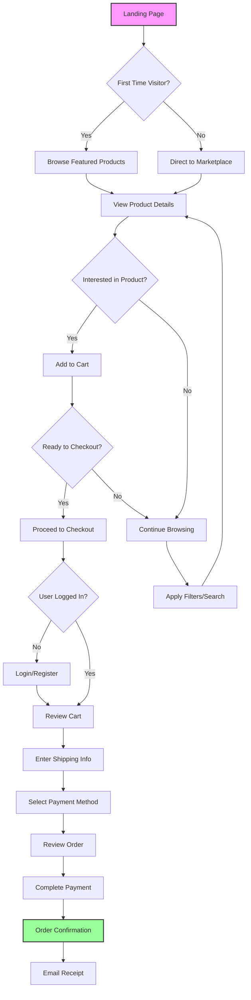
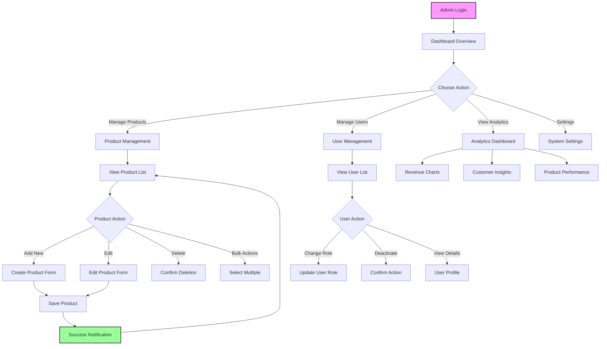

# BeeSure User Flow Diagrams

## 🛍️ Customer Shopping Journey

### **Primary Shopping Flow**



### **Product Discovery Flow**

```
┌─────────────────┐    ┌─────────────────┐    ┌─────────────────┐
│   Landing Page  │───▶│   Marketplace   │───▶│ Product Detail  │
│                 │    │                 │    │                 │
│ • Hero Section  │    │ • Product Grid  │    │ • Image Gallery │
│ • Featured      │    │ • Filters       │    │ • Description   │
│ • Trust Badges  │    │ • Search        │    │ • NFT Info      │
│ • CTA Buttons   │    │ • Sorting       │    │ • Reviews       │
└─────────────────┘    └─────────────────┘    └─────────────────┘
         │                       │                       │
         ▼                       ▼                       ▼
┌─────────────────┐    ┌─────────────────┐    ┌─────────────────┐
│ Newsletter      │    │ Category Pages  │    │ Add to Cart     │
│ Signup          │    │                 │    │                 │
└─────────────────┘    └─────────────────┘    └─────────────────┘
```

### **Authentication Flow**

```
┌─────────────────┐    ┌─────────────────┐    ┌─────────────────┐
│ Guest User      │───▶│ Login Required  │───▶│ Login Page      │
│                 │    │                 │    │                 │
│ • Browse freely │    │ • Checkout      │    │ • Email/Pass    │
│ • Add to cart   │    │ • Save items    │    │ • Demo creds    │
│ • View products │    │ • User profile  │    │ • Register link │
└─────────────────┘    └─────────────────┘    └─────────────────┘
                                │                       │
                                ▼                       ▼
                       ┌─────────────────┐    ┌─────────────────┐
                       │ Registration    │    │ Authenticated   │
                       │                 │    │                 │
                       │ • User details  │    │ • Full access   │
                       │ • Email verify  │    │ • Order history │
                       │ • Welcome msg   │    │ • Saved items   │
                       └─────────────────┘    └─────────────────┘
```

## 👨‍💼 Admin Management Workflows

### **Admin Dashboard Flow**



### **Product Management Workflow**

```
┌─────────────────┐    ┌─────────────────┐    ┌─────────────────┐
│ Product List    │───▶│ Add New Product │───▶│ Product Form    │
│                 │    │                 │    │                 │
│ • Search/Filter │    │ • Click Add     │    │ • Name/Price    │
│ • Sort Options  │    │ • Quick Action  │    │ • Description   │
│ • Bulk Select   │    │                 │    │ • Images        │
│ • Actions Menu  │    │                 │    │ • Categories    │
└─────────────────┘    └─────────────────┘    └─────────────────┘
         │                                              │
         ▼                                              ▼
┌─────────────────┐                          ┌─────────────────┐
│ Edit Product    │                          │ Form Validation │
│                 │                          │                 │
│ • Pre-filled    │◀─────────────────────────│ • Required      │
│ • Same form     │                          │ • Format check  │
│ • Update mode   │                          │ • Error display │
└─────────────────┘                          └─────────────────┘
         │                                              │
         ▼                                              ▼
┌─────────────────┐                          ┌─────────────────┐
│ Save Changes    │                          │ Success State   │
│                 │─────────────────────────▶│                 │
│ • API call      │                          │ • Notification  │
│ • Loading state │                          │ • Redirect      │
└─────────────────┘                          └─────────────────┘
```

### **User Role Management Flow**

```
Admin Dashboard
       │
       ▼
┌─────────────────┐
│ User Management │
│                 │
│ • User List     │
│ • Role Filters  │
│ • Search Users  │
└─────────────────┘
       │
       ▼
┌─────────────────┐    ┌─────────────────┐    ┌─────────────────┐
│ Select User     │───▶│ Actions Menu    │───▶│ Role Change     │
│                 │    │                 │    │                 │
│ • Click user    │    │ • Make Admin    │    │ • Confirmation  │
│ • View profile  │    │ • Remove Admin  │    │ • Update role   │
│ • Check details │    │ • Deactivate    │    │ • Notify user   │
└─────────────────┘    └─────────────────┘    └─────────────────┘
```

## 🔐 Authentication & Authorization Flows

### **Role-Based Access Control**

```
┌─────────────────┐
│ User Login      │
│                 │
│ • Email/Pass    │
│ • Validate      │
│ • Check role    │
└─────────────────┘
         │
         ▼
┌─────────────────┐
│ Role Detection  │
│                 │
│ • Admin?        │
│ • Customer?     │
│ • Guest?        │
└─────────────────┘
         │
    ┌────┴────┐
    ▼         ▼
┌─────────┐ ┌─────────┐
│ Admin   │ │Customer │
│ Access  │ │ Access  │
│         │ │         │
│ • Full  │ │ • Shop  │
│ • CRUD  │ │ • View  │
│ • Users │ │ • Cart  │
│ • Stats │ │ • Order │
└─────────┘ └─────────┘
```

### **Protected Route Flow**

```
User Navigates to /admin
         │
         ▼
┌─────────────────┐
│ Check Auth      │
│                 │
│ • Token valid?  │
│ • User exists?  │
└─────────────────┘
         │
    ┌────┴────┐
    ▼         ▼
┌─────────┐ ┌─────────┐
│ Logged  │ │ Not     │
│ In      │ │ Logged  │
└─────────┘ └─────────┘
    │           │
    ▼           ▼
┌─────────┐ ┌─────────┐
│ Check   │ │Redirect │
│ Role    │ │to Login │
└─────────┘ └─────────┘
    │
┌───┴───┐
▼       ▼
┌─────┐ ┌─────┐
│Admin│ │User │
│Allow│ │Deny │
└─────┘ └─────┘
```

## 🛒 E-commerce Transaction Flow

### **Checkout Process**

```
Shopping Cart
     │
     ▼
┌─────────────────┐    ┌─────────────────┐    ┌─────────────────┐
│ Review Cart     │───▶│ User Info       │───▶│ Shipping Info   │
│                 │    │                 │    │                 │
│ • Items list    │    │ • Login check   │    │ • Address       │
│ • Quantities    │    │ • Guest option  │    │ • Delivery      │
│ • Totals        │    │ • Registration  │    │ • Instructions  │
└─────────────────┘    └─────────────────┘    └─────────────────┘
                                │                       │
                                ▼                       ▼
                       ┌─────────────────┐    ┌─────────────────┐
                       │ Payment Method  │    │ Order Review    │
                       │                 │    │                 │
                       │ • Credit card   │    │ • Final check   │
                       │ • PayPal        │    │ • Terms agree   │
                       │ • Crypto        │    │ • Place order   │
                       └─────────────────┘    └─────────────────┘
                                │                       │
                                ▼                       ▼
                       ┌─────────────────┐    ┌─────────────────┐
                       │ Payment Process │    │ Order Success   │
                       │                 │    │                 │
                       │ • Validate      │    │ • Confirmation  │
                       │ • Charge        │    │ • Email receipt │
                       │ • Confirm       │    │ • Order number  │
                       └─────────────────┘    └─────────────────┘
```

### **NFT Certificate Flow**

```
Product Purchase
     │
     ▼
┌─────────────────┐
│ NFT Option      │
│                 │
│ • Enable NFT?   │
│ • Extra cost    │
│ • Benefits      │
└─────────────────┘
     │
     ▼
┌─────────────────┐    ┌─────────────────┐    ┌─────────────────┐
│ Wallet Connect  │───▶│ Mint NFT        │───▶│ Certificate     │
│                 │    │                 │    │                 │
│ • MetaMask      │    │ • Blockchain    │    │ • View cert     │
│ • Web3 auth     │    │ • Transaction   │    │ • Download      │
│ • Network       │    │ • Confirmation  │    │ • Share link    │
└─────────────────┘    └─────────────────┘    └─────────────────┘
```

## 📱 Mobile User Experience Flow

### **Mobile Navigation Pattern**

```
Mobile Homepage
     │
     ▼
┌─────────────────┐
│ Header          │
│ ☰ 🍯BeeSure 🛒👤│
└─────────────────┘
     │
     ▼ (tap hamburger)
┌─────────────────┐
│ Slide Menu      │
│                 │
│ • Home          │
│ • Marketplace   │
│ • Trace Honey   │
│ • About         │
│ • Contact       │
│ • Login         │
└─────────────────┘
```

### **Mobile Shopping Flow**

```
Product Grid (2 cols)
     │
     ▼ (tap product)
┌─────────────────┐
│ Product Detail  │
│                 │
│ • Image carousel│
│ • Stacked info  │
│ • Sticky CTA    │
└─────────────────┘
     │
     ▼ (add to cart)
┌─────────────────┐
│ Cart Drawer     │
│                 │
│ • Slide up      │
│ • Quick view    │
│ • Checkout CTA  │
└─────────────────┘
```

This comprehensive flow documentation provides clear pathways for users and administrators, ensuring intuitive navigation and efficient task completion throughout the BeeSure platform.
